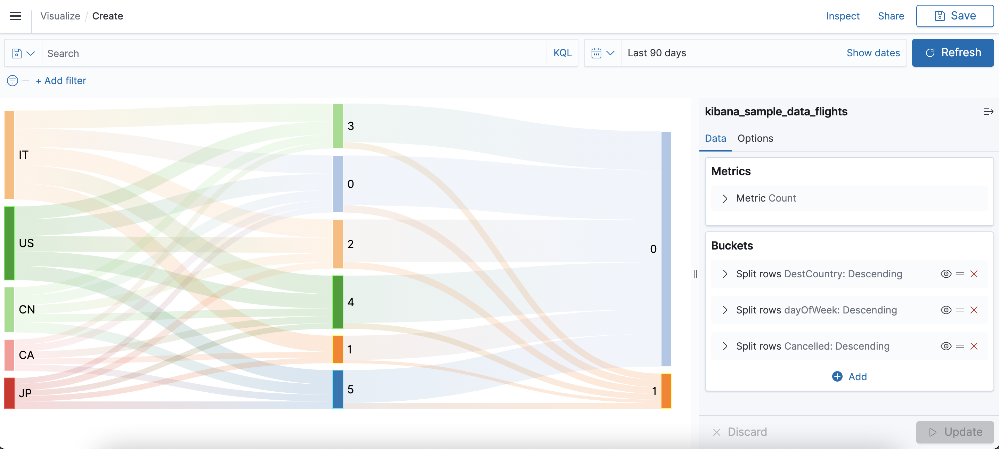

# Kibana Sankey Diagram Plugin

This is a sankey diagram visType plugin for Kibana 7.x.

This plugin was developped from <https://github.com/elastic/kibana/pull/4832>.

Here is an example:



# Install

```
git clone https://github.com/creditsoftware/kbn_sankey_vis.git sankey_vis
cd sankey_vis
yarn install
yarn start
```
# Use
* Navigate to Kibana (http://localhost:5601).
* Go to "Visualize" app.
* Click "Create visualization".
* Choose "Sankey Diagram"
# Uninstall

```
bin/kibana-plugin remove kbn-sankey-vis
```

# Building a Release
Building a release only means packaging the plugin with all its dependencies into a zip archive. Important is to put the plugin in a folder called kibana before zipping it.
The following steps would produce a release of the current head master branch.
```
mkdir kibana
git clone https://github.com/creditsoftware/kbn_sankey_vis.git sankey_vis
cd sankey_vis
[optional] git checkout -branch
yarn install
yarn build --kibana-version X.Y.Z # replace 'X.Y.Z' by desired Kibana version
```
